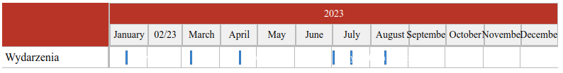

This project that is simply poc. I was playing with CalDAV protocol. This app basically takes your nextcloud caldav url, username and password from `.env` file and displayes events from provided caledar url on the timeline. App is pretty much featureless since it's just proof of concept. App uses electron (to solve issues with CORS when calling CalDAV endpoint) and craco to provide additional configuration for libraries that uses some node packages that are not available in browser (look `craco.config.js`).

